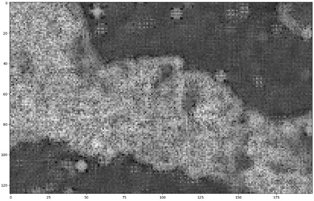
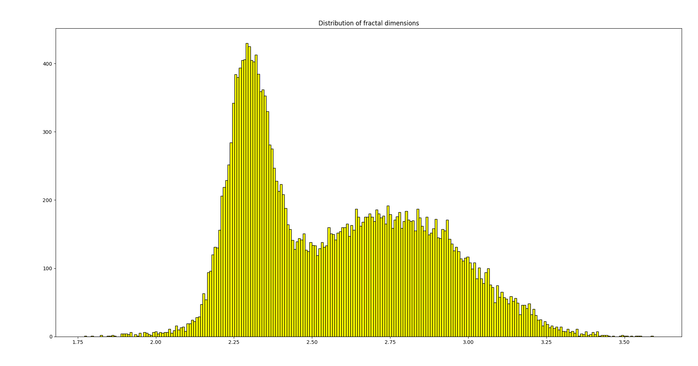
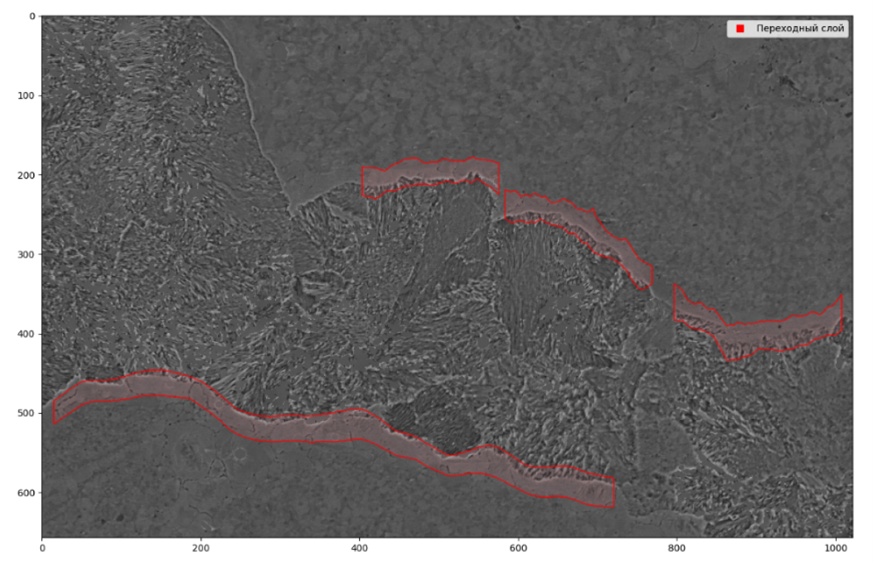
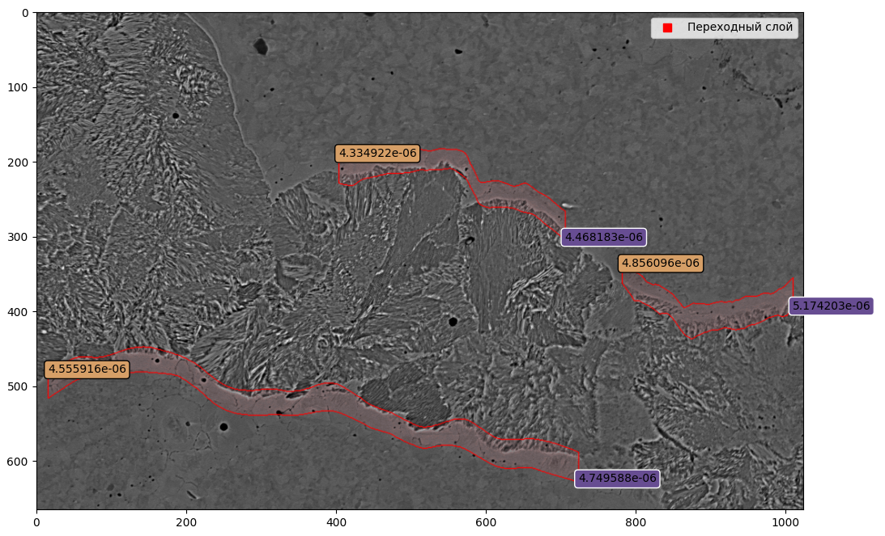

<h1 align="center">Фрактальный анализ снимка сплава металла</h1>

<b>Цель работы</b>: измерение переходного слоя на снимке сплава двух сталей (Сталь Э76 и сталь 12Х18Н10Т)

### Краткое описание метода решения

    
<em>Рис 1. Пример снимка сплава</em>    
    
Cегментация проводится на основе фрактального анализа:    
 
1. С помощью оконной обработки составляется поле фрактальных размерностей (ФР)    
  
    
<em>Рис 2. Пример поля фрактальных размерностей</em>    
  
    
<em>Рис 3. Пример распределения фрактальных размерностей</em>    
  

2. Анализируется распределение ФР с помощью EM-алгоритма    
    * Если поле ФР - это смесь 2-х распределений, выделяются участки поля, где участки, принадлежащие одному распределению, сменяются на участки, принадлежащие другому     
    * Если поле ФР - это смесь 3-х распределений, выделяются участки, принадлежащие распределению с минимальным мат. ожиданием    
3. Выделенные области сглаживаются LOWESS-регрессией или морфологическими преобразованиями, в зависимости от метода выбора областей в пункте 2    
 
    
<em>Рис 4. Пример сегментации</em>    
  
4. Измеряется ширина выделенных областей с помощью построения нормалей в точках контура и поиска расстояния до первой точки пересечения нормали и контура    
  
    
<em>Рис 5. Пример результатов измерения выделенных областей (Фиолетовым - результат по методу измерения нормалью, желтым - по методу измерения расстояния между точками лежащих в одной плоскости Х)</em>    
  

### Задачи проекта
___
:white_check_mark: Реализация измерения поля ФР    
:white_check_mark: Анализ поля ФР с 2-мя распределениями    
:white_check_mark: Анализ поля ФР с 3-мя распределениями    
:white_check_mark: Сглаживание выделенных областей    
:white_check_mark: Разработка алгоритма измерения выделенных областей    
:white_check_mark: Реализация графического интерфейса    
:black_square_button: Анализ распределения ширины областей вдоль контура    
:black_square_button: Исследование ускорения вычисления поля ФР с помощью Cython или Numba    

