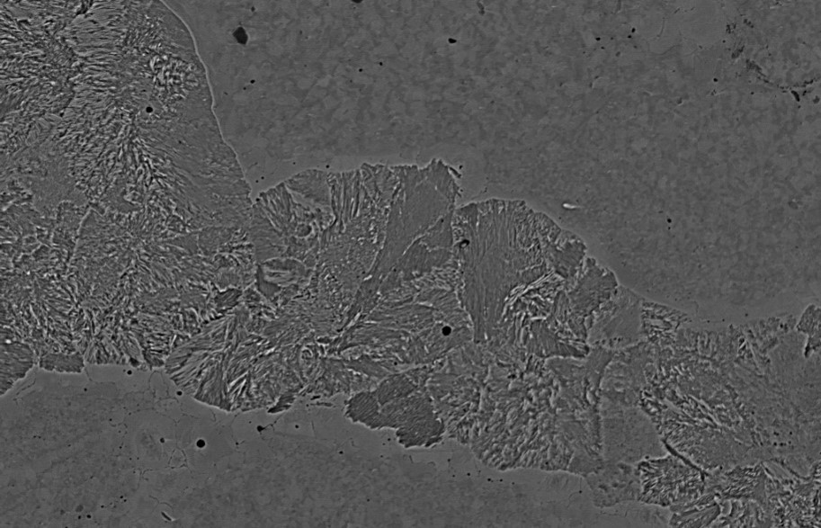

<h1 align="center">Фрактальный анализ снимка сплава металла</h1>

___

<b>Цель работы</b>: Измерение переходного слоя на снимке сплава двух сталей (Сталь Э76 и сталь 12Х18Н10Т)

### Краткое описание метода решения

<em>Рис 1. Пример снимка сплава</em>

Cегментация проводится на основе фрактального анализа:

1. С помощью оконной обработки составляется поле фрактальных размерностей (ФР)

<em>Рис 2. Пример поля фрактальных размерностей</em>
    
<em>Рис 3. Пример распределения фрактальных размерностей</em>
2. Анализируется распределение ФР с помощью EM-алгоритма
    1. Если поле ФР - это смесь 2-х распределений, выделяются участки поля, где участки, принадлежащие одному распределению, сменяются на участки, принадлежащие другому 
    2. Если поле ФР - это смесь 3-х распределений, выделяются участки, принадлежащие распределению с минимальным мат. ожиданием
3. Выделенные области сглаживаются LOWESS-регрессией или морфологическими преобразованиями, в зависимости от метода выбора областей в пункте 2

<em>Рис 4. Пример сегментации</em>
4. Измеряется ширина выделенных областей с помощью построения нормалей в точках контура и поиска расстояния до первой точки пересечения нормали и контура

<em>Рис 5. Пример результатов измерения выделенных областей 
Фиолетовым - результат по методу измерения нормалью  
Желтым - по методу измерения </em>

### Задачи проекта
___
:white_check_mark: Реализация измерения поля ФР
:white_check_mark: Анализ поля ФР с 2-мя распределениями
:white_check_mark: Анализ поля ФР с 3-мя распределениями
:white_check_mark: Сглаживание выделенных областей
:white_check_mark: Разработка алгоритма измерения выделенных областей
:white_check_mark: Реализация графического интерфейса
:black_square_button: Анализ распределения ширины областей вдоль контура
:black_square_button: Исследование ускорения вычисления поля ФР с помощью Cython или Numba

