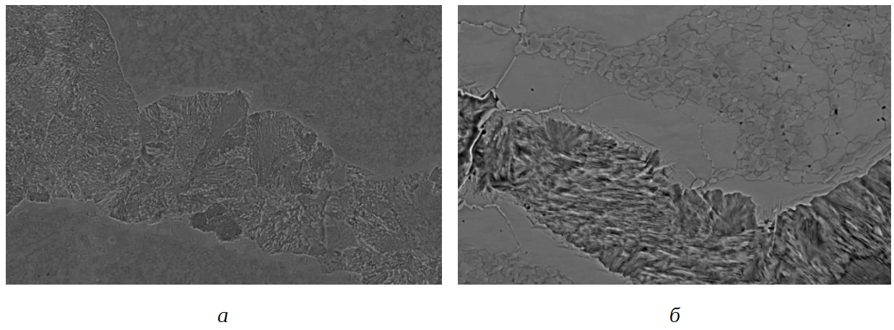
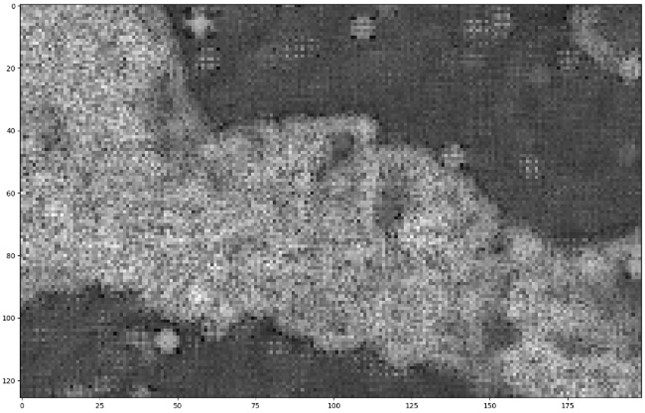
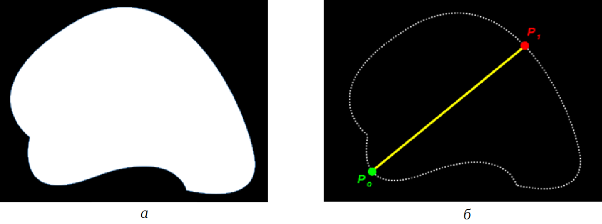

<h1 align="center">Фрактальный анализ снимков сплава смесей металлов</h1>

<b>Цель работы</b>: измерение переходного слоя на снимке сплава двух сталей (Сталь Э76 и сталь 12Х18Н10Т)

   

<em>Рис 1. Пример снимка сплава: а – через 5 минут после SPS-спекания, 
б – через 20 минут после SPS-спекания</em>

## Предобработка изображений

Снимки сплавов имеют черные области, которые сильно влияют на текстурный анализ.

<em>Рис 2. Пример областей шума</em>

Чтобы минимизировать искажения при анализе, данные области были обработаны по алгоритму,
изображенному на рис. 3.

<em>Рис 3. Алгоритм обработки изображений</em>

## Алгоритм сегментации переходного слоя
  
1. С помощью оконной обработки по методу треугольных призм составить поле фрактальных размерностей (ПФР)
с использованием измерительного окна ширины $w$, то есть измерить фрактальную размерность
в каждой точке изображения.

Значение фрактальной размерности оценивается по одному из параметров регрессионной модели следующего вида:
$$
\ln{f(L)}=\mathbb{C}+(2-D)\ln{\delta},
$$
где $L$ - измерительное окно, $f(L)$ - суммарная площадь верхних граней 
треугольных призм, построенных в каждом субокне, $D$ - фрактальная размерность,
$\delta$ - ширина субокна (измерительное окно делится на субокна разной ширины). Оценка параметров регрессии проводится по методу наименьших квадратов.
 

<em>Рис 4. Пример визуализации поля фрактальных размерностей для снимка с рис.1-а</em>

 
При составления гистограмм полученных значений фрактальных размерностей 
было обнаружено, что для одних изображений можно охарактеризовать ПФР 
как смесь двух нормальных распределений, а для других – трёх.

2. Анализ гистограммы ПФР для определения количества компонент в смеси:

   2.1. Применить EM-алгоритм для разделения смеси на две компоненты и построить функцию плотности всей смеси $f_2(x)$
   
   2.2. Применить EM-алгоритм для разделения смеси на три компоненты и построить функцию плотности всей смеси $f_3(x)$
   
   2.3. По критерию согласия $\chi^2$ Пирсона оценить, какая функция плотности лучше описывает гистограмму ПФР.
 

<em>Рис 5. Распределение фрактальных размерностей в ПФР для снимков с рис. 1</em>

От количества компонент в смеси распределений, зависит дальнейший анализ ПФР.

### Если ПФР - смесь двух распределений

3.1. В каждом столбце ПФР произвести медианную фильтрацию с шириной фильтра $[w/2]$ и найти такие точки, где происходит изменение
фрактальной размерности, соответствующей одной текстуре металла, на другую.
 

<em>Рис 6. Пример найденных точек после шага 3.1. </em>

3.2. Кластеризировать полученный набор точек с помощью DBSCAN-алгоритма
и отбросить кластер шумов, определенный алгоритмом

3.3. Отбросить кластеры точек по критерию
$$
|C|<\frac{\sum_{i}^{N}|C_i|}{N},
$$
где $C$ – текущий кластер объёма $|𝐶|$, для которого проводится проверка, 
$N$ – количество кластеров, $C_i$ – $𝑖$-й кластер.
 

<em>Рис 7. Пример точек после шага 3.3. </em>

3.4. Построить кривые, описывающие границы участков переходного слоя, 
вдоль каждого кластера с помощью LOWESS-регрессии
 

<em>Рис 8. Пример кривых, построенных вдоль кластеров точек</em>

3.5. Создать чёрное изображение с размерами ПФР и закрасить белым цветом
области между кривыми, построенными на прошлом шаге
 

<em>Рис 9. Пример результата алгоритма сегментации для снимка с рис. 1-а</em>

### Если ПФР - смесь трёх распределений

4.1. Для ПФР применить алгоритм кластеризации $k$-средних по 3 кластерам.

4.2. Создать бинарное изображение с размерами ПФР, где белым цветом
выделить точки, которые соответствуют точкам сформированного кластера с
наименьшим значением центра.
 

<em>Рис 10. Пример бинарного изображения, созданного после шага 2, для снимка с рис.1-б</em>

4.3. Воспользоваться морфологическими операциями: 
1) операцией «открытие», ядро – эллипс с диаметром 9 пикселей;
 
2) операцией «закрытие», ядро – эллипс с диаметром 7 пикселей.

4.4. Удалить мелкие объекты на бинарном изображении по критерию:
$$
S<\frac{\sum_{i}^{N_o}S_i}{N_o},
$$
где $𝑆$ – площадь текущего объекта, для которого проводится проверка, 
$𝑆_𝑖$ – площадь $𝑖$-го объекта, $N_o$ – количество объектов на бинарном 
изображении.

4.5. Применить морфологическую операцию «дилатация» со структурным
элементом эллипс с диаметром $𝑤/2$.
 

<em>Рис 11. Пример результата алгоритма сегментации для снимка с рис. 2-а</em>

### Измерение ширины объектов

Под шириной переходного слоя понимается среднее значение расстояния между 
произвольными точками контура, из которой опускается нормаль, 
и точками, лежащими на пересечении нормалей и контура переходного слоя.

Например, на рис. 12 из точки контура $𝑃_0$ построена нормаль (желтая прямая),
которая пересекает контур объекта в точке $𝑃_1$. Шириной объекта в точке 
$𝑃_0$ является расстояние между точками $𝑃_0$ и $𝑃_1$. Ширина всего объекта -
медианное значений ширины объекта во всех точках контура с исключением выбросов
по [методу Тьюки](https://www.geeksforgeeks.org/maths/outlier/).

<em>Рис 12. Измерение ширины объекта на бинарном изображении:
а – бинарное изображение с объектом, б – пример построения нормали из точки 
контура</em>

 
# Дополнительно

[Описание ПО по ГОСТу](readme/software.md)

