<h1 align="center">Измерение ширины переходного слоя сплавов 
на основе фрактального анализа изображений</h1>

# Описание исследования

Данная работа посвящёна автоматическому анализу снимков микроструктур металлических 
сплавов, полученных методом SPS-спекания (Spark Plasma Sintering).

При SPS-спекании между двумя порошковыми смесями различных металлов формируется 
**переходный слой**.

<div align="center">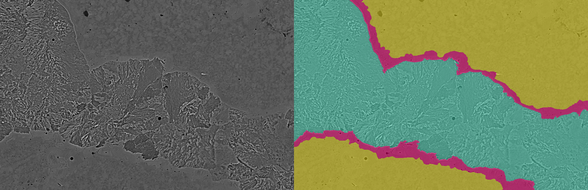</div>
<div align="center">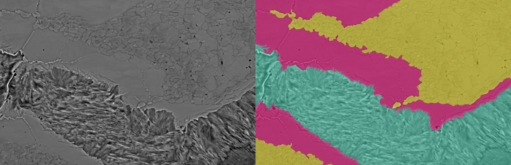</div>
<p align="center"><em>Рис 1. Примеры снимков сплава (слева) и их разметки (справа): 
желтая область - Сталь Э76, голубая - Сталь 12Х18Н10Т, розовая - переходный слой</em></p>

Ширина переходного слоя оказывает существенное влияние на механические свойства 
материала, включая хрупкость и теплопроводность. В настоящее время её измерение 
выполняется вручную по снимкам сплавов, что занимает значительное время, 
зависит от субъективности исследователя и может приводить к погрешностям.

**Цель работы** — разработать алгоритм автоматической сегментации и измерения ширины 
переходного слоя по снимкам микроструктуры сплава двух смесей металлов.

**Входные данные:** изображения, сделанные электронным микроскопом, формата TIF с 
размером 1024x768 пикселей и интенсивностью белого от 0 до 255 (градация серого).

---

# Общая схема метода решения

## 1. Предобработка изображений

На первом этапе выполняется подавление шумов на изображениях для 
повышения стабильности дальнейшего анализа. За шумы принимаются ярко выраженные черные
области на текстурах смесей металлов.

<div align="center">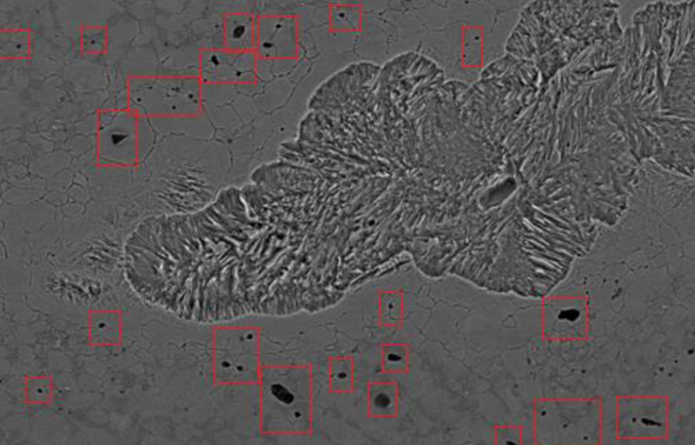</div>
<p align="center"><em>Рис 3. Пример областей шума</em></p>

Используются классические методы фильтрации изображений.

<div align="center">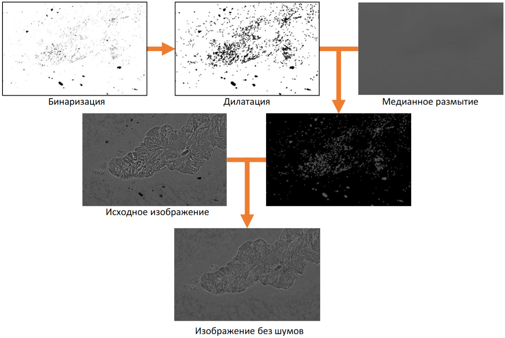</div>
<p align="center"><em>Рис 4. Алгоритм обработки изображений</em></p>

## 2. Построение поля фрактальных размерностей

Так как переходный слой и смеси металлов отличаются друг от друга текстурами, был выбран
один из текстурных методов анализа изображений.
Посредством оконной обработки изображения для каждого локального участка 
(измерительного окна $L$ ширины $w$) вычисляется **фрактальная размерность текстуры** $D$
в каждой точке изображения.

Значение фрактальной размерности оценивается по одному из параметров регрессионной
модели следующего вида ([метод треугольных призм](https://elibrary.ru/item.asp?id=32476442)):

$$\ln{f(L)}=\mathbb{C}+(2-D)\ln{\delta},$$

где $f(L)$ - суммарная площадь верхних граней треугольных призм, 
построенных в каждом субокне, $\delta$ - ширина субокна (измерительное окно 
делится на субокна разной ширины). Оценка параметров регрессии проводится по 
методу наименьших квадратов.

Матрица со значениями фрактальной размерности в каждой точке изображения называется
**полем фрактальных размерностей** (ПФР).

## 3. Анализ распределения фрактальных размерностей

Распределение фрактальной размерности по всему ПФР принимается за 
смесь нормальных распределений. Рассматриваются два варианта:
- ПФР как смесь из 2 компонент, соответствующих текстуре каждой из смесей металлов (переходный слой
в этом случае слишком мал на снимке, чтобы формировать третью компоненту)
- ПФР как смесь из 3 компонент.

Для каждого варианта строится функция плотности смеси, параметры которых
оцениваются с помощью **EM-алгоритма**.

Для выбора модели, наилучшим образом описывающей гистограмму ПФР,
используется критерий согласия **$\chi^2$ Пирсона**.

<div align="center">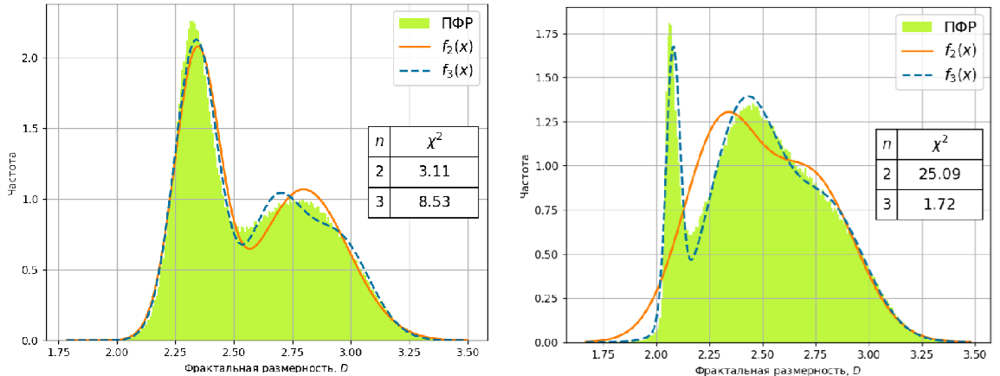</div>
<p align="center"><em>Рис 5. Распределение фрактальных размерностей в ПФР для снимков с рис. 1</em></p>

---

## 4. Сегментация переходного слоя

Результат алгоритма сегментации - бинарное изображение, где белые объекты
соответствуют областям переходного слоя на анализируемом изображении.

### Случай 1. Если ПФР - двухкомпонентная смесь

Алгоритм сегментации:

1. столбцовый анализ ПФР - в каждом столбце ПФР найти такие точки, между
которыми происходит изменение фрактальной размерности, соответствующей одной
из текстур, на фрактальную размерность другой текстуры;
2. для найденных точек применить алгоритм кластеризации **DBSCAN**;
3. удалить точки-шумы, определенные DBSCAN-алгоритмом;
4. отбросить кластеры точек по критерию:
$$|C|<\frac{\sum_{i}^{N}|C_i|}{N},$$

    где $C$ – текущий кластер объёма $|𝐶|$, для которого проводится проверка, 
$N$ – количество кластеров, $C_i$ – $𝑖$-й кластер;
5. вдоль каждого кластеры построить кривые с помощью **LOWESS-регрессии**;
6. по построенным кривым построить бинарное изображение.

<p float="left" align="center">
    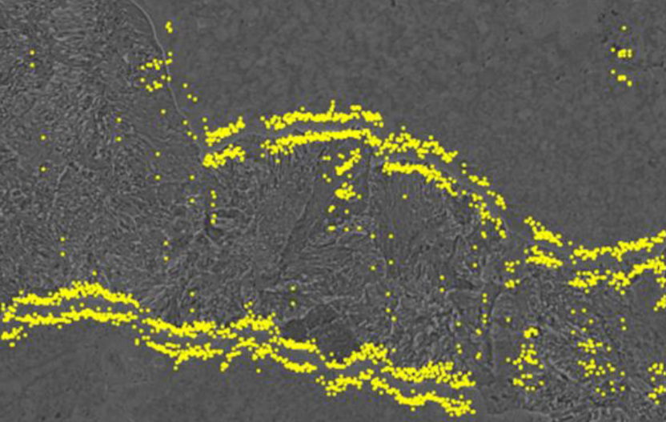
    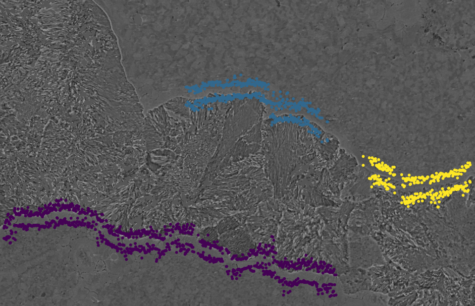
</p>
<p float="left" align="center">
  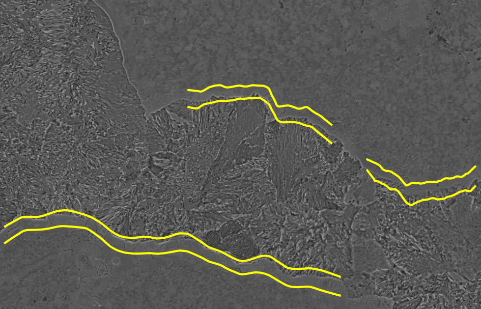
  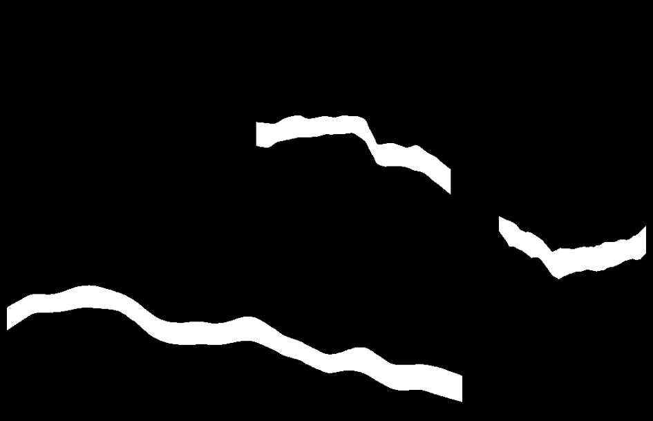
</p>
<p align="center"><em>Рис 6. Пример результатов первого алгоритма сегментации:
сверху-слева - после шага 1, сверху-справа - после шага 4, снизу-слева - после шага 5,
снизу-справа - после шага 6</em></p>


### Случай 2. Если ПФР - трёхкомпонентная смесь

В этом случае компонента в смеси с минимальным центром, принимается как компонента,
соответствующая перехоному слою. Алгоритм сегментации:

1. выполнить кластеризацию **k-means**;
2. создать бинарное изображение - белым цветом выделить области переходного слоя,
определенные алгоритмом на шаге 1;
3. уточнить границы объектов морфологическими операциями «открытие» и «закрытие»;
4. на бинарном изображении удалить мелкие объекты по критерию:
$$S<\frac{\sum_{i}^{N_o}S_i}{N_o},$$
где $𝑆$ – площадь текущего объекта, для которого проводится проверка, 
$𝑆_𝑖$ – площадь $𝑖$-го объекта, $N_o$ – количество объектов на бинарном 
изображении;
5. применить морфологическую операцию «дилатация».

<p float="left" align="center">
    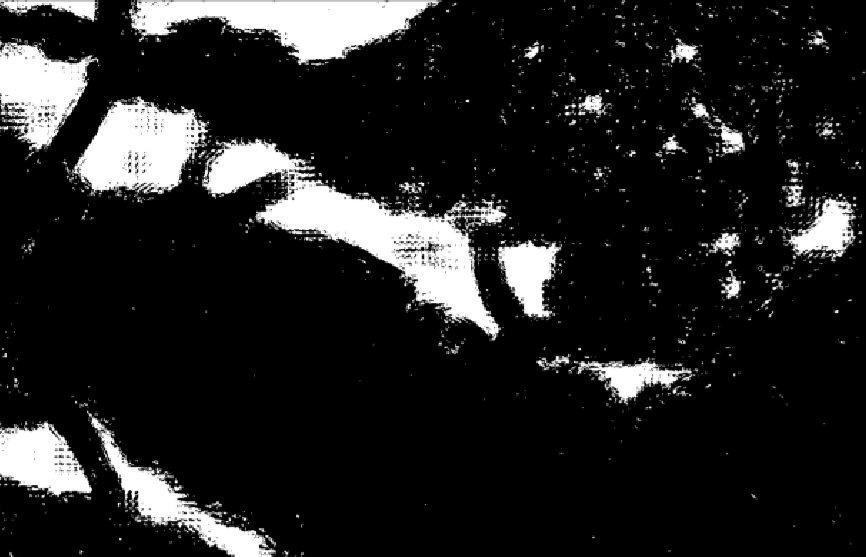
    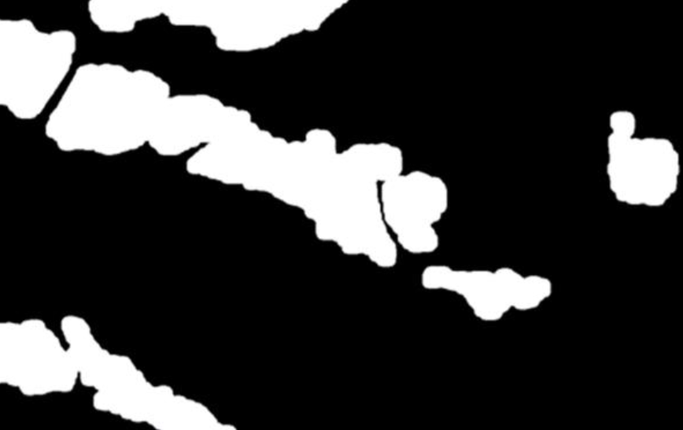
</p>
<p align="center"><em>Рис 7. Пример результатов второго алгоритма сегментации:
слева - после шага 2, справа - после шага 5</em></p>

---

## 5. Оценка ширины переходного слоя

Ширина переходного слоя на снимке вычисляется по следующему алгоритму:

1. для каждой точки контура объекта на бинарном изображении построить нормаль;
2. ширина определяется как расстояние между точкой контура и первой точкой 
пересечения нормали с противоположной границей;
3. итоговое значение ширины всего объекта определяется как 
**медиана всех измерений ширины** с исключением выбросов
по [методу Тьюки](https://www.geeksforgeeks.org/maths/outlier/).


---

# Программное обеспечение

Для удобства анализа с помощью языка Python 3.12 разработано приложение 
с графическим интерфейсом на базе PyQt.

Функциональность:
- загрузка изображений сплавов смесей металлов;
- визуализация промежуточных этапов обработки;
- отображение результатов сегментации;
- вычисление ширины переходного слоя.

<div align="center">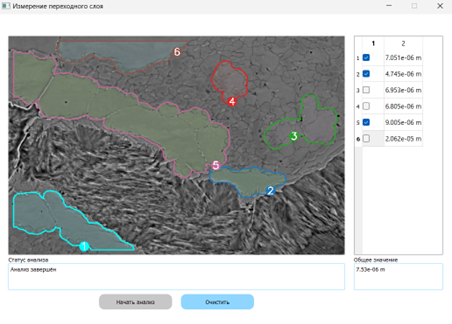</div>
<p align="center"><em>Рис 8. Интерфейс программы</em></p>

Для ускорения вычислений реализованы:

- параллельные вычисления при построении поля фрактальных размерностей;
- многопоточность и синхронизация потоков через мутекс и сигналы PyQt.

Благодаря чему удалось ускорить вычисления примерно в 5 раз.

Подробнее: см. [описание ПО по ГОСТу](readme/software.md)

## Используемые библиотеки

- NumPy
- SciPy
- scikit-learn
- OpenCV
- statsmodels
- PyQt
- multiprocessing
- threading

Версии библиотек см. в [requirements.txt](requirements.txt)

## Запуск

```
pip install -r requirements.txt
python Interface.py
```

См. [здесь](./readme/software.md#5-вызов-и-загрузка) про создание исполняемого файла.