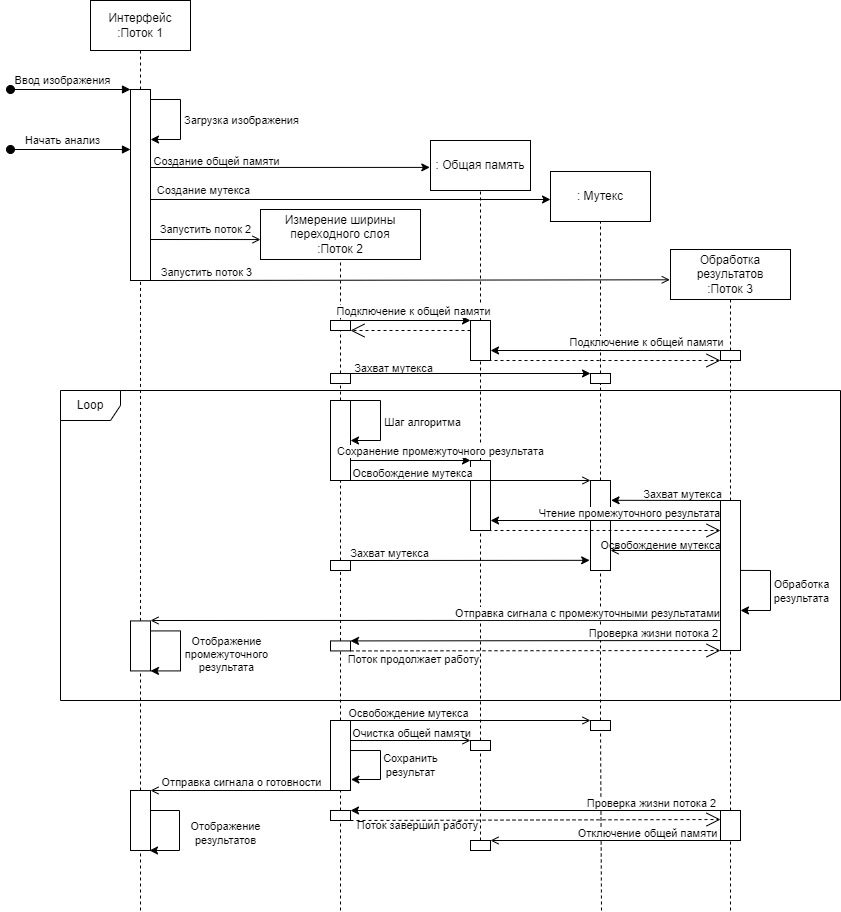

Ниже приведено описание разработанного программного обеспечения в 
соответствии с ГОСТ 19.402-78.

1. [Общие сведения](#1-общие-сведения)
   1. [Обозначение и наименование программы](#11-обозначение-и-наименование-программы)
   2. [Программное обеспечение, необходимое для функционирования программы](#12-программное-обеспечение-необходимое-для-функционирования-программы)
   3. [Языки программирования, на которых написана программа](#13-языки-программирования-на-которых-написана-программа)
2. [Функциональное назначение](#2-функциональное-назначение)
   1. [Классы решаемых задач](#21-классы-решаемых-задач)
   2. [Назначение программы](#22-назначение-программы)
3. [Описание логической структуры](#3-описание-логической-структуры)
   1. [Описание алгоритма работы программы](#31-описание-алгоритма-работы-программы)
   2. [Логическая структура программы](#32-логическая-структура-программы)
   3. [Описание программных модулей](#33-описание-программных-модулей)
4. [Используемые технические средства](#4-используемые-технические-средства)
5. [Вызов и загрузка](#5-вызов-и-загрузка)
6. [Входные данные](#6-входные-данные)
7. [Выходные данные](#7-выходные-данные)

# 1. Общие сведения
## 1.1. Обозначение и наименование программы
Программы оценки ширины переходного слоя по снимкам сплава смесей двух металлов имеет следующие атрибуты:
- название: «Измерение переходного слоя»;
- язык интерфейса: русский;
- размер исполняемого файла: 155 Мб;
- занимаемый размер на носителе: 155 Мб.

## 1.2. Программное обеспечение, необходимое для функционирования программы

Системные программные средства, используемые разработанной программой 
оценки ширины переходного слоя, должны быть представлены операционной
системой Windows (Windows 10, Windows 11).

Для функционирования программы необходимо установить интерпретатор языка 
программирования Python версии не ниже 3.12, и следующие сторонние библиотеки:
-	PyQt5 версии 5.15.10;
-	NumPy версии 1.26.4;
-	OpenCV-Python версии 4.9.0.80;
-	Pillow версии 10.3.0;
-	Scikit-learn версии 1.5.0;
-	SciPy версии 1.13.1;
-	Statsmodels версии 0.14.2.

## 1.3. Языки программирования, на которых написана программа

Программа была реализована на высокоуровневом интерпретируемом языке 
программирования Python версии 3.12.

# 2. Функциональное назначение

## 2.1. Классы решаемых задач

Программа предназначена для оценки ширины переходного слоя в сплаве двух 
смесей металлов, созданного с помощью SPS-спекания, по снимкам сплава, 
сделанных с помощью электронного микроскопа.

## 2.2. Назначение программы

Программа реализует функции, перечисленные ниже.
1.	Устранение шумов на снимке сплава двух смесей металлов.
2.	Сегментация на снимках сплава двух смесей металлов областей переходного слоя на основе текстурного анализа изображения.
3.	Оценка ширины переходного слоя по снимкам сплава двух смесей металлов.

# 3. Описание логической структуры

## 3.1. Описание алгоритма работы программы

Алгоритм работы программы состоит из следующим шагов:
1.	открытие изображения с расширением TIF с помощью диалогового ок-на;
2.	запуск анализа изображения;
3.	отображение промежуточных результатов в окне интерфейса;
4.	отображение результатов сегментации в виде выделенных областей на изображении;
5.	отображение в таблице значений ширины каждого выделенного объекта на изображении;
6.	отображение в текстовом поле результата оценки ширины переходного слоя;
7.	очистка данных.

## 3.2. Логическая структура программы

В ходе выполнения программы порождается три потока: поток графического
интерфейса, поток анализа изображения, поток обработки промежуточных 
результатов. Для взаимодействия и синхронизации потоков используется общая 
память, мутекс и сигналы. Диаграмма последовательности работы потоков 
приведена на рисунке 1.

<em>Рис 1. Диаграмма последовательности работы потоков в программе</em>

При запуске программы создаётся первый поток, в котором инициализируется 
графический интерфейс программы. При выборе пользователем входного изображения 
с помощью интерфейса и получении команды о начале анализа первый поток 
инициализирует общую память, мутекс, второй и третий поток. Задача второго 
потока – выполнить алгоритмы сегментации и оценки ширины переходного слоя 
на изображении. Задача третьего потока – принять и обработать промежуточные
результаты второго потока для отправки их в первый поток для визуализации.

Третий поток получает промежуточные результаты через общую память и мутекс. 
В начале своей работы второй поток захватывает мутекс, и, когда будут готовы 
первые промежуточные результаты, заносит их в общую память и освобождает 
мутекс. В этот момент третий поток захватывает мутекс и читает данные из 
общей памяти. Когда данные будут полностью прочитаны, мутекс освобождается 
третьи потоком, и захватывается вторым. Третий поток обрабатывает данные для 
их визуализации в виде изображения. После обработки данных изображение с 
визуализацией отправляется в первый поток в качестве сигнала. Первый поток 
принимает сигнал с данными и отображает изображение в интерфейсе.

Данная последовательность действий продолжается, пока второй поток не закончит 
свою работу. По его окончании второй поток отправляет в первый поток сигнал 
о своём завершении. После чего третий поток закрывает общую память и 
завершает свою работу.

Первый поток продолжает свою работу до закрытия программы.

## 3.3. Описание программных модулей

Программа реализована в виде 10 модулей: 6 основных и 4 вспомогательных. 
Ниже приведено описание 6 основных модулей.

### Модуль Interface.py

Модуль Interface.py состоит из определения 4 классов: PageWindow, MainWindow, 
Window, TableOfResults. Класс Window является расширением класса QMainWindow 
фреймворка PyQt5. Описание методов Window приведено в таблице 1.

**_Таблица 1 - Описание класса Window_**
<table class="iksweb">
		<tr>
			<td>№</td>
			<td>Метод</td>
			<td colspan="2">Описание</td>
		</tr>
		<tr>
			<td rowspan="2">1</td>
			<td rowspan="2">__init__</td>
			<td>Вход</td>
			<td>отсутствует</td>
		</tr>
		<tr>
			<td>Процесс</td>
			<td>Конструктор класса Window. Определяет размеры окна и инициализирует страницы интерфейса.</td>
		</tr>
		<tr>
			<td rowspan="2">2</td>
			<td rowspan="2">register</td>
			<td>Вход</td>
			<td>widget: страница, QMainWindow;
name: название страницы, str;
</td>
		</tr>
		<tr>
			<td>Процесс</td>
			<td>Привязывает к основному окну страницы интерфейса.</td>
		</tr>
		<tr>
			<td rowspan="2">3</td>
			<td rowspan="2">goto</td>
			<td>Вход</td>
			<td>Name: название страницы, тип str</td>
		</tr>
		<tr>
			<td>Процесс</td>
			<td>Приёмщик сигналов. Отображает в интерфейсе страницу по её названию</td>
		</tr>
</table>

Класс PageWindow является расширением класса QMainWindow фреймворка PyQt5. 
Описание методов PageWindow приведено в таблице 2.

**_Таблица 2 - Описание класса PageWindow_**

<table class="iksweb">
		<tr>
			<td>№</td>
			<td>Метод</td>
			<td colspan="2">Описание</td>
		</tr>
		<tr>
			<td rowspan="2">1</td>
			<td rowspan="2">goto</td>
			<td>Вход</td>
			<td>name: название страницы, тип str</td>
		</tr>
		<tr>
			<td>Процесс</td>
			<td>Отправляет сигнал о смене страницы в интерфейсе по её названию.</td>
		</tr>
</table>

Класс MainWindow является расширением класса PageWindow. Описание методов 
MainWindow приведено в таблице 3.

**_Таблица 3 - Описание класса MainWindow_**

<table class="iksweb">
	<tbody>
		<tr>
			<td>№</td>
			<td>Метод</td>
			<td colspan="2">Описание</td>
		</tr>
		<tr>
			<td rowspan="2">1</td>
			<td rowspan="2">__init__</td>
			<td>Вход</td>
			<td>отсутствует</td>
		</tr>
		<tr>
			<td>Процесс</td>
			<td>Конструктор класса Window. Определяет размеры окна и инициализирует страницы интерфейса.</td>
		</tr>
		<tr>
			<td rowspan="2">2</td>
			<td rowspan="2">initUI</td>
			<td>Вход</td>
			<td>отсутствует</td>
		</tr>
		<tr>
			<td>Процесс</td>
			<td>Инициализирует основные графические элементы интерфейса.</td>
		</tr>
		<tr>
			<td rowspan="2">3</td>
			<td rowspan="2">make_handleButton</td>
			<td>Вход</td>
			<td>button: название кнопки, тип str</td>
		</tr>
		<tr>
			<td>Процесс</td>
			<td>Обрабатывает нажатия кнопок и вызывает соответствующие методы по названию кнопки</td>
		</tr>
		<tr>
			<td rowspan="2">4</td>
			<td rowspan="2">inputImage</td>
			<td>Вход</td>
			<td>отсутствует</td>
		</tr>
		<tr>
			<td>Процесс</td>
			<td>Открывает изображение, выбранное с помощью диалогового окна, и отправляет его в модуль Program.</td>
		</tr>
		<tr>
			<td rowspan="2">5</td>
			<td rowspan="2">startAnalysis</td>
			<td>Вход</td>
			<td>отсутствует</td>
		</tr>
		<tr>
			<td>Процесс</td>
			<td>Запускает анализ изображения в модуле Program.</td>
		</tr>
		<tr>
			<td rowspan="2">6</td>
			<td rowspan="2">changeImage</td>
			<td>Вход</td>
			<td>image: изображение, тип QImage</td>
		</tr>
		<tr>
			<td>Процесс</td>
			<td>Отображает входное изображение в интерфейсе.</td>
		</tr>
		<tr>
			<td rowspan="2">7</td>
			<td rowspan="2">putStepOnTextField</td>
			<td>Вход</td>
			<td>message: сообщение о текущем шаге анализа, тип str</td>
		</tr>
		<tr>
			<td>Процесс</td>
			<td>Отображает сообщение в текстовом поле в интерфейсе.</td>
		</tr>
		<tr>
			<td rowspan="2">8</td>
			<td rowspan="2">checkBoxChanged</td>
			<td>Вход</td>
			<td>отсутствует</td>
		</tr>
		<tr>
			<td>Процесс</td>
			<td>Вызывает метод calculateTotalValue при изменении выбора объектов в таблице.</td>
		</tr>
		<tr>
			<td rowspan="2">9</td>
			<td rowspan="2">clearClick</td>
			<td>Вход</td>
			<td>отсутствует</td>
		</tr>
		<tr>
			<td>Процесс</td>
			<td>Очищает таблицу и изображение в интерфейсе. Вызывает метод clear в модуле Program.</td>
		</tr>
	</tbody>
</table>

TableOfResults является внутренним классом класса MainWindow и расширяет 
класс QTableWidget фреймворка PyQt5. Описание методов TableOfResults 
приведено в таблице 4.

**_Таблица 4 - Описание класса TableOfResults_**

<table class="iksweb">
	<tbody>
		<tr>
			<td>№</td>
			<td>Метод</td>
			<td colspan="2">Описание</td>
		</tr>
		<tr>
			<td rowspan="2">1</td>
			<td rowspan="2">__init__</td>
			<td>Вход</td>
			<td>parent: родительский объект, по умолчанию - None;
slotForChange: функция, выполняющаяся при измерении полей check-box в таблице.
</td>
		</tr>
		<tr>
			<td>Процесс</td>
			<td>Конструктор класса TableOfResults.</td>
		</tr>
		<tr>
			<td rowspan="2">2</td>
			<td rowspan="2">showResult</td>
			<td>Вход</td>
			<td>result: объект, содержащий результаты измерений каждого объекта, единицу измерения и коэффициент масштабирования, тип ResultsOfAnalysis.</td>
		</tr>
		<tr>
			<td>Процесс</td>
			<td>Отображает результаты измерения объектов на изображении в таблице в интерфейсе.</td>
		</tr>
	</tbody>
</table>

### Модуль Program.py

Модуль Program.py состоит из определения классов Program и ResultsOfAnalysis. 
Описание методов Program приведено в таблице 5. Описание методов 
ResultsOfAnalysis приведено в таблице 6.

**_Таблица 5 - Описание класса Program_**

<table class="iksweb">
	<tbody>
		<tr>
			<td>№</td>
			<td>Метод</td>
			<td colspan="2">Описание</td>
		</tr>
		<tr>
			<td rowspan="2">1</td>
			<td rowspan="2">__init__</td>
			<td>Вход</td>
			<td>signalForImage: сигнал для отправки изображе-ния, тип QSignal;
signalForCurrentStep: сигнал для отправки инфор-мации о текущем шаге анализа, тип QSignal;
signalForResult: сигнал для отправки результатов анализа, тип QSignal;
</td>
		</tr>
		<tr>
			<td>Процесс</td>
			<td>Конструктор класса Program. Инициализирует мутекс.</td>
		</tr>
		<tr>
			<td rowspan="3">2</td>
			<td rowspan="3">inputImage</td>
			<td>Вход</td>
			<td>path: путь изображения, тип str</td>
		</tr>
		<tr>
			<td>Процесс</td>
			<td>Открывает изображение по заданному пути. Инициализирует объекта класса EstimationTransitionLayer, и подставляет в него изображение. Отправляет сигнал в интерфейс для отображения изображения.</td>
		</tr>
		<tr>
			<td>Выход</td>
			<td>True – если изображение успешно загружено, иначе – False, тип bool.</td>
		</tr>
		<tr>
			<td rowspan="2">3</td>
			<td rowspan="2">initAnalysis</td>
			<td>Вход</td>
			<td>Отсутствует</td>
		</tr>
		<tr>
			<td>Процесс</td>
			<td>Инициализирует общую память, второй и третий поток и запускает их.</td>
		</tr>
		<tr>
			<td rowspan="2">4</td>
			<td rowspan="2">_programAnalysis</td>
			<td>Вход</td>
			<td>Отсутствует</td>
		</tr>
		<tr>
			<td>Процесс</td>
			<td>Функция второго потока. Запускает метод esti-mateTransitionLayer у объекта класса Estimation-TransitionLayer для оценки ширины переходного слоя.</td>
		</tr>
		<tr>
			<td rowspan="2">5</td>
			<td rowspan="2">_processingResult</td>
			<td>Вход</td>
			<td>Отсутствует</td>
		</tr>
		<tr>
			<td>Процесс</td>
			<td>Функция третьего потока. Обрабатывает проме-жуточные результаты второго потока и отправля-ет сигналы в первые поток.</td>
		</tr>
		<tr>
			<td rowspan="2">6</td>
			<td rowspan="2">clear</td>
			<td>Вход</td>
			<td>Отсутствует</td>
		</tr>
		<tr>
			<td>Процесс</td>
			<td>Очищает текущее изображение. Закрывает общую память.</td>
		</tr>
	</tbody>
</table>

**_Таблица 6 - Описание класса ResultsOfAnalysis_**

<table class="iksweb">
	<tbody>
		<tr>
			<td>№</td>
			<td>Метод</td>
			<td colspan="2">Описание</td>
		</tr>
		<tr>
			<td rowspan="2">1</td>
			<td rowspan="2">__init__</td>
			<td>Вход</td>
			<td>scaleCoef: коэффициент масштабирования, тип float;
scaleCoefFromUnit: исходная единица измерения, тип str;
unit: единица измерения, к которой приводит коэффициент масштабирования, тип str;
</td>
		</tr>
		<tr>
			<td>Процесс</td>
			<td>Конструктор класса ResultsOfAnalysis.</td>
		</tr>
		<tr>
			<td rowspan="2">2</td>
			<td rowspan="2">setResult</td>
			<td>Вход</td>
			<td>results: результаты измерений ширины объектов в каждой точке их контура, тип list</td>
		</tr>
		<tr>
			<td>Процесс</td>
			<td>Сохраняет результаты работы алгоритмов измерения ширины переходного слоя.</td>
		</tr>
		<tr>
			<td rowspan="3">3</td>
			<td rowspan="3">getTotalWidth</td>
			<td>Вход</td>
			<td>flags: список флагов, тип list.</td>
		</tr>
		<tr>
			<td>Процесс</td>
			<td>Вычисляет оценку ширины переходного слоя по выбранным объектам.</td>
		</tr>
		<tr>
			<td>Выход</td>
			<td>Строковое представление результата оценки общей ширины переходного слоя по выбранным объектам, тип str.</td>
		</tr>
		<tr>
			<td rowspan="2">4</td>
			<td rowspan="2">clear</td>
			<td>Вход</td>
			<td>Отсутствует</td>
		</tr>
		<tr>
			<td>Процесс</td>
			<td>Очищает поля класса.</td>
		</tr>
	</tbody>
</table>

### Модуль EstimationTransitionLayer.py
Модуль EstimationTransitionLayer.py состоит из определения класса 
EstimationTransitionLayer. Описание методов EstimationTransitionLayer приведено 
в таблице 7.

**_Таблица 7 - Описание класса EstimationTransitionLayer_**

<table class="iksweb">
	<tbody>
		<tr>
			<td>№</td>
			<td>Метод</td>
			<td colspan="2">Описание</td>
		</tr>
		<tr>
			<td rowspan="2">1</td>
			<td rowspan="2">__init__</td>
			<td>Вход</td>
			<td>showStep: флаг об отображении промежуточных результатов на экране, тип bool, по умолчанию – False.</td>
		</tr>
		<tr>
			<td>Процесс</td>
			<td>Конструктор класса EstimationTransitionLayer.</td>
		</tr>
		<tr>
			<td rowspan="3">2</td>
			<td rowspan="3">estimate</td>
			<td>Вход</td>
			<td>mutex: мутекс, тип Lock, по умолчанию – None;
sharedMemoryName: название общей память, тип str, по умолчанию – None;</td>
		</tr>
		<tr>
			<td>Процесс</td>
			<td>Сегментирует и измеряют ширину переходного слоя на изображении</td>
		</tr>
		<tr>
			<td>Выход</td>
			<td>Список, где один элемент – список значений ширины соответствующего объекта в каждой точке его контура, тип list.</td>
		</tr>
		<tr>
			<td rowspan="2">3</td>
			<td rowspan="2">setImage</td>
			<td>Вход</td>
			<td>image: изображение для анализа, тип numpy.ndarray</td>
		</tr>
		<tr>
			<td>Процесс</td>
			<td>Проверяет изображение на корректность и сохраняет в своей памяти.</td>
		</tr>
		<tr>
			<td rowspan="2">4</td>
			<td rowspan="2">_calculateField</td>
			<td>Вход</td>
			<td>отсутствует</td>
		</tr>
		<tr>
			<td>Процесс</td>
			<td>Составляет ПФР изображения.</td>
		</tr>
		<tr>
			<td rowspan="2">5</td>
			<td rowspan="2">_segmentTransitionLayer</td>
			<td>Вход</td>
			<td>отсутствует</td>
		</tr>
		<tr>
			<td>Процесс</td>
			<td>На основе количества компонент в распределе-нии ПФР определяет алгоритм сегментации</td>
		</tr>
		<tr>
			<td rowspan="2">6</td>
			<td rowspan="2">_analysisFieldWithTwoComponents</td>
			<td>Вход</td>
			<td>отсутствует</td>
		</tr>
		<tr>
			<td>Процесс</td>
			<td>Сегментирует области переходного слоя по пер-вому алгоритму</td>
		</tr>
		<tr>
			<td rowspan="2">7</td>
			<td rowspan="2">_analysisFieldWithThreeComponents</td>
			<td>Вход</td>
			<td>отсутствует</td>
		</tr>
		<tr>
			<td>Процесс</td>
			<td>Сегментирует области переходного слоя по вто-рому алгоритму</td>
		</tr>
		<tr>
			<td rowspan="2">8</td>
			<td rowspan="2">_findExtrWithDiff</td>
			<td>Вход</td>
			<td>Вызывает метод calculateTotalValue при изменении выбора объектов в таблице.</td>
		</tr>
		<tr>
			<td>Процесс</td>
			<td>Определяет точки для множеств A и B по пер-вому алгоритму сегментации.</td>
		</tr>
		<tr>
			<td rowspan="2">9</td>
			<td rowspan="2">_segmentForDistribution</td>
			<td>Вход</td>
			<td>img: бинарное изображение, тип numpy.ndarray</td>
		</tr>
		<tr>
			<td>Процесс</td>
			<td>Делает морфологические операции над изобра-жением по второму алгоритму сегментации.</td>
		</tr>
		<tr>
			<td rowspan="2">10</td>
			<td rowspan="2">_putInSharedMemory</td>
			<td>Вход</td>
			<td>data: данные, отправляемые в общую память.</td>
		</tr>
		<tr>
			<td>Процесс</td>
			<td>Записывает в общей памяти данные, освобождает и захватывает мутекс.</td>
		</tr>
	</tbody>
</table>

### Модуль MeasurementOnBinaryImage.py
Модуль MeasurementOnBinaryImage.py состоит из определения класса 
MeasureObjects. Описание методов MeasureObjects приведено в таблице 8.

**_Таблица 8 - Описание класса MeasureObjects_**

<table class="iksweb">
	<tbody>
		<tr>
			<td>№</td>
			<td>Метод</td>
			<td colspan="2">Описание</td>
		</tr>
		<tr>
			<td rowspan="2">1</td>
			<td rowspan="2">__init__</td>
			<td>Вход</td>
			<td>showStep: флаг об отображении промежуточных результатов на экране, тип bool, по умолчанию – False.</td>
		</tr>
		<tr>
			<td>Процесс</td>
			<td>Конструктор класса MeasureObjects.</td>
		</tr>
		<tr>
			<td rowspan="3">2</td>
			<td rowspan="3">__call__</td>
			<td>Вход</td>
			<td>mask: бинарное изображение с объектами для измерения их ширины, тип numpy.ndarray;
borderSize: отступ, которые необходимо сделать от краёв изображения, тип int</td>
		</tr>
		<tr>
			<td>Процесс</td>
			<td>Определяет контуры каждого объекта на изображении и измеряет ширину каждого объекта в каждой точке его контура</td>
		</tr>
		<tr>
			<td>Выход</td>
			<td>Список, где один элемент – список значений ширины соответствующего объекта в каждой точке его контура, тип list.</td>
		</tr>
		<tr>
			<td rowspan="3">3</td>
			<td rowspan="3">_measureObject</td>
			<td>Вход</td>
			<td>contourObject: массив точек контура объекта, тип numpy.ndarray;</td>
		</tr>
		<tr>
			<td>Процесс</td>
			<td>Измеряет ширину заданного объекта в каждой точке его контура.</td>
		</tr>
		<tr>
			<td>Выход</td>
			<td>Список значений ширины объекта в каждой точке его контура, тип list.</td>
		</tr>
		<tr>
			<td rowspan="3">4</td>
			<td rowspan="3">_defineAreaDifferentiation</td>
			<td>Вход</td>
			<td>contourObject: массив точек контура объекта, тип numpy.ndarray;
indexPoint: номер точки в массиве contourObject, тип int.</td>
		</tr>
		<tr>
			<td>Процесс</td>
			<td>Определяет область дифференцирования области контура.</td>
		</tr>
		<tr>
			<td>Выход</td>
			<td>Два числа - границы дифференцирования (слева и справа), тип tuple[int, int]</td>
		</tr>
		<tr>
			<td rowspan="3">5</td>
			<td rowspan="3">_findIntersectionWith-NormalFromPoint</td>
			<td>Вход</td>
			<td>contourObject: массив точек контура объекта, тип numpy.ndarray;
indexPoint: номер точки в массиве contourObject, тип int.</td>
		</tr>
		<tr>
			<td>Процесс</td>
			<td>Ищет точку пересечения контура и нормали, опущенной из точки indexPoint.</td>
		</tr>
		<tr>
			<td>Выход</td>
			<td>Расстояние между точкой indexPoint и точкой, лежащей на пересечении нормали и контура, тип float.</td>
		</tr>
		<tr>
			<td rowspan="3">6</td>
			<td rowspan="3">_distance</td>
			<td>Вход</td>
			<td>point1, point2: точки контура, тип np.ndarray.</td>
		</tr>
		<tr>
			<td>Процесс</td>
			<td>Вычисляет расстояние между точками.</td>
		</tr>
		<tr>
			<td>Выход</td>
			<td>Расстояние между точками, тип float.</td>
		</tr>
	</tbody>
</table>

### Модуль WindowProcessing.py
Модуль WindowProcessing.py состоит из определения классов WindowProcessing и 
WindowFunc. Описание методов WindowProcessing приведено в таблице 9. 
Описание методов WindowFunc приведено в таблице 10.

**_Таблица 9 - Описание класса WindowProcessing_**

<table class="iksweb">
	<tbody>
		<tr>
			<td>№</td>
			<td>Метод</td>
			<td colspan="2">Описание</td>
		</tr>
		<tr>
			<td rowspan="2">1</td>
			<td rowspan="2">__init__</td>
			<td>Вход</td>
			<td>kwargs: словарь настроек оконной обработки, тип dict.</td>
		</tr>
		<tr>
			<td>Процесс</td>
			<td>Конструктор класса WindowProcessing.</td>
		</tr>
		<tr>
			<td rowspan="3">2</td>
			<td rowspan="3">_generateWindows</td>
			<td>Вход</td>
			<td>img: анализируемое изображение, тип numpy.ndarray.</td>
		</tr>
		<tr>
			<td>Процесс</td>
			<td>Определяет массив измерительных окон с учётом настроек оконной обработки изображения.</td>
		</tr>
		<tr>
			<td>Выход</td>
			<td>Массив измерительных окон, тип numpy.ndarray</td>
		</tr>
		<tr>
			<td rowspan="3">3</td>
			<td rowspan="3">processing</td>
			<td>Вход</td>
			<td>img: анализируемое изображение, тип numpy.ndarray;
userWindowFunc: оконная функция, которую необходимо вычислить в каждом измерительном окне, тип function;
args: список дополнительных аргументов для оконной функции, тип list</td>
		</tr>
		<tr>
			<td>Процесс</td>
			<td>Вычисляет значения оконной функции в каждой точке изображения.</td>
		</tr>
		<tr>
			<td>Выход</td>
			<td>Массив результатов вычисления оконной функции для изображения, тип numpy.ndarray.</td>
		</tr>
	</tbody>
</table>

**_Таблица 10 - Описание класса WindowFunc_**

<table class="iksweb">
	<tbody>
		<tr>
			<td>№</td>
			<td>Метод</td>
			<td colspan="2">Описание</td>
		</tr>
		<tr>
			<td rowspan="2">1</td>
			<td rowspan="2">__init__</td>
			<td>Вход</td>
			<td>func: оконная функция, тип function;
args: список дополнительных аргументов для оконной функции, тип list
</td>
		</tr>
		<tr>
			<td>Процесс</td>
			<td>Конструктор класса WindowFunc.</td>
		</tr>
		<tr>
			<td rowspan="3">2</td>
			<td rowspan="3">__call__</td>
			<td>Вход</td>
			<td>window: окно, тип numpy.ndarray.</td>
		</tr>
		<tr>
			<td>Процесс</td>
			<td>Вычисляет значение оконной функции в заданном окне.</td>
		</tr>
		<tr>
			<td>Выход</td>
			<td>Значение оконной функции, тип float.</td>
		</tr>
	</tbody>
</table>

### Модуль CountComponents.py
Модуль CountComponents.py состоит из определения класса CountComponents. 
Описание методов CountComponents приведено в таблице 11.

**_Таблица 11 - Описание класса CountComponents_**

<table class="iksweb">
	<tbody>
		<tr>
			<td>№</td>
			<td>Метод</td>
			<td colspan="2">Описание</td>
		</tr>
		<tr>
			<td rowspan="2">1</td>
			<td rowspan="2">__init__</td>
			<td>Вход</td>
			<td>minCount: минимальное количество компонент в смеси распределений, тип int;
maxCount: максимальное количество компонент в смеси распределений, тип int;</td>
		</tr>
		<tr>
			<td>Процесс</td>
			<td>Конструктор класса CountComponents.</td>
		</tr>
		<tr>
			<td rowspan="3">2</td>
			<td rowspan="3">__call__</td>
			<td>Вход</td>
			<td>data: набор данных, характеризующиеся смесью нормальных распределений, тип numpy.ndarray.</td>
		</tr>
		<tr>
			<td>Процесс</td>
			<td>Определяет количество компонент в заданной смеси нормальных распределений.</td>
		</tr>
		<tr>
			<td>Выход</td>
			<td>Количество компонент в заданной смеси распределений, тип int</td>
		</tr>
	</tbody>
</table>

# 4. Используемые технические средства

Для работы программы достаточно иметь персональный компьютер, удовлетворяющий 
следующим минимальным характеристикам:
-	процессор: AMD Phenom II X4 965, Intel Core i3-2100 или аналогичный;
-	оперативная память: 2 ГБ;
-	жесткий диск: не менее 256 МБ свободного места;
-	дисплей;
-	манипулятор «мышь».

# 5. Вызов и загрузка

Вызов программы с носителя осуществляется с помощью запуска исполняемого файла 
main.exe. В случае, если программа представлена только исходными текстами 
(файлы Interface.py, Program.py, EstimationTransitionLayer.py, 
MeasurementOnBinaryImage.py, CountComponents.py, FractalAnalysisInImage.py, 
Image.py, ImagesMetadata.py, Line.py, WindowProcessing.py), то, можно 
осуществить запуск программы, выполнив через командную строку CMD или 
PowerShell, из директории со всеми исходными файлами, команду интерпретатора 
языка Python: `python Interface.py`. Предварительно нужно установить 
используемые в программе программные библиотеки с помощью системы управления 
пакетами pip, которая поставляется вместе с интерпретатором языка Python. 
Команда для установки из командной строки: 
`python -m pip install <название библиотеки>==<номер версии>` 
(все требуемые для работы программные библиотеки и их версии указаны в 
разделе 1.2). 

Для самостоятельной подготовки исполняемого файла необходимо установить пакет 
pyinstaller из командной строки CMD или PowerShell, выполнив: 
`python -m pip install pyinstaller`. После чего из директории, где расположены 
все файлы с исходными текстами программы, запустить команду: 
`pyinstaller --noconfirm --onedir --windowed --add-data "<путь к директории>;<название директории>/" "<путь к директории>/Interface.py"`, где:
-	`<путь к директории>` – абсолютный путь к директории на диске, содержащей 
исходные файлы проекта;
-	`<название директории>` – название директории на диске, содержащей исходные 
файлы проекта.

После того как выполнение команды завершится, в директории, где она была 
запущена, будет создана директория dist/Interface с исполняемым файлом 
Interface.exe, для которого можно создать ярлык и работать далее только с ним.

# 6. Входные данные

Входными данными программы являются изображения расширения TIF, созданные с 
помощью системы электронного микроскопа. Изображение обязательно должно быть 
оригиналом или полной копией файла, созданного с помощью системы электронного 
микроскопа. В обратном случае, файл не будет содержать метаданных, записанных 
системой микроскопа, и оценка ширины переходного слоя не будет действительна: 
все измерения будут проведены в пикселях.

# 7. Выходные данные

Выходные данные работы программы выводятся пользователю в поля интерфейса: 
поле изображения, таблица измерений ширины объектов, текстовое поле с 
результатом оценки общей ширины. Пример выходных результатов программы 
приведен на рисунке 2.

<em>Рис 2. Пример вывода результатов работы программы</em>

